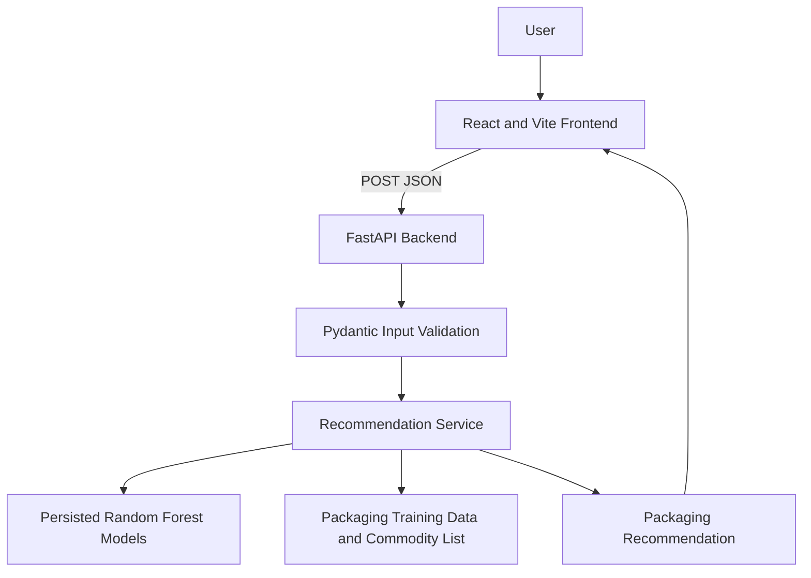

# Food Packaging Prediction System

## Project Overview

The Food Packaging Prediction System is a web application that recommends suitable food packaging based on food properties, storage conditions, shelf-life requirements, and transportation conditions. It combines a React web interface with a FastAPI REST API and trained machine-learning models.

The application is intended as a prototype decision-support tool. Its recommendations should be reviewed and validated by food-packaging professionals before production use.

## Problem Statement

Choosing appropriate packaging is important for maintaining food quality, safety, freshness, and shelf life. Packaging requirements depend on factors such as moisture, fat, pH, water activity, temperature, humidity, gas exchange, storage type, and transportation conditions. Assessing these factors consistently can help support packaging selection and shelf-life planning.

## Solution

Users enter food, physiological, storage, shelf-life, and transportation parameters through the web interface. The backend validates the input, loads the trained packaging models, generates packaging-related predictions, and returns a recommendation containing a material estimate and related packaging requirements.

The recommendation service uses the existing trained models to estimate:

- Recommended material
- Film thickness
- Oxygen transmission requirement (OTR)
- Water vapor transmission requirement (WVTR)
- Sealability
- Modified-atmosphere packaging (MAP) suitability
- Mechanical strength

## Key Features

- Food packaging recommendation
- Food and product property inputs
- Water activity input
- Respiration rate and ethylene rate inputs
- Storage temperature and relative humidity inputs
- Desired shelf-life input
- Storage type selection: ambient, chilled, or frozen
- Transportation condition selection: normal, refrigerated, or frozen
- Data-driven recommendation using trained Random Forest models
- Responsive React web interface
- FastAPI REST API
- CORS support for the deployed frontend
- Optional MongoDB connectivity for backend runtime status

## Technology Stack

### Frontend

- React 19
- Vite
- Material UI
- Emotion for Material UI styling

### Backend

- Python
- FastAPI
- Uvicorn
- Pydantic

### Machine Learning and Data Processing

- scikit-learn
- pandas
- NumPy
- joblib for persisted model files
- Random Forest models for packaging outputs
- CSV-based packaging training data and food data resources

### Database

- MongoDB through PyMongo
- The connection is configured with `MONGODB_URI` and is optional for generating the model recommendation.

### Deployment

- Frontend: Vercel
- Backend: Render

## System Architecture



## Input Parameters

The `PackagingInput` schema defines the following request fields:

| Field | Type | Required | Description | Constraints or allowed values |
| --- | --- | --- | --- | --- |
| `commodity` | string | Yes | Food or commodity being packaged. | 1-120 characters; must exist in the loaded commodity dataset. |
| `moisture` | number | Yes | Moisture content. | 0-100 |
| `fat` | number | Yes | Fat content. | 0-100 |
| `ash` | number or null | No | Ash content when available. | 0-100 |
| `sodium` | number or null | No | Sodium value when available. | Must be non-negative |
| `pH` | number | Yes | Acidity or alkalinity of the food. | 0-14 |
| `water_activity` | number | Yes | Water activity of the food. | 0-1 |
| `respiration_rate` | number | Yes | Respiration rate of the food. | Must be non-negative |
| `ethylene_rate` | number | Yes | Ethylene production rate. | Must be non-negative |
| `temperature` | number | Yes | Storage temperature. | -30 to 60 |
| `relative_humidity` | number | Yes | Relative humidity during storage. | 0-100 |
| `desired_shelf_life` | number | Yes | Target shelf life. | Greater than 0 |
| `storage_type` | string | Yes | Storage environment. | `ambient`, `chilled`, or `frozen` |
| `transportation_condition` | string | Yes | Transportation environment. | `normal`, `refrigerated`, or `frozen` |

## API Documentation

### Recommendation Endpoint

```text
POST https://food-packaging-prediction-system.onrender.com/packaging/recommend
```

The endpoint accepts a JSON body matching `PackagingInput`.

Example request:

```json
{
  "commodity": "tomato",
  "moisture": 94,
  "fat": 0.2,
  "pH": 4.3,
  "water_activity": 0.98,
  "respiration_rate": 25,
  "ethylene_rate": 4,
  "temperature": 10,
  "relative_humidity": 90,
  "desired_shelf_life": 14,
  "storage_type": "chilled",
  "transportation_condition": "refrigerated"
}
```

`ash` and `sodium` are optional schema fields and may be included when their values are available.

Successful responses contain:

```json
{
  "success": true,
  "input": {},
  "prototype": true,
  "model": "Random Forest",
  "recommendation": {
    "material": "...",
    "material_code": "...",
    "thickness": {
      "value": 0,
      "unit": "um",
      "status": "model estimate"
    },
    "otr": {
      "requirement_score": 0,
      "unit": "normalized requirement score"
    },
    "wvtr": {
      "requirement_score": 0,
      "unit": "normalized requirement score"
    },
    "sealability": "...",
    "map": {
      "suitable": true,
      "classification": "..."
    },
    "mechanical_strength": {
      "classification": "..."
    }
  },
  "reason": "...",
  "warning": "..."
}
```

The numeric values and classifications are produced by the loaded models. The response includes a prototype warning because the current training labels are synthetic and require validation before production use.

Other backend routes include:

- `GET /api/health`
- `GET /packaging/commodities`
- `GET /packaging/model-status`
- `POST /packaging/predict`

## Screenshots

### Home / Recommendation Interface

<!-- Add screenshot here -->

### Recommendation Result

<!-- Add screenshot here -->

## Installation and Local Setup

### Backend

From the repository root:

```bash
cd backend
python -m venv .venv
```

Activate the virtual environment:

```bash
# macOS or Linux
source .venv/bin/activate

# Windows PowerShell
.venv\Scripts\Activate.ps1
```

Install the Python dependencies and start the API:

```bash
pip install -r requirements.txt
uvicorn app.main:app --reload --port 5000
```

The backend will be available at `http://localhost:5000`.

### Frontend

In a second terminal:

```bash
cd frontend
npm install
```

Set the frontend API base URL in `frontend/.env`:

```env
VITE_API_URL=http://localhost:5000
```

Start the Vite development server:

```bash
npm run dev
```

The Vite configuration uses port `5174` for local development. The frontend calls `${VITE_API_URL}/packaging/recommend`.

To create a production frontend build:

```bash
npm run build
```

## Environment Variables

Set these variables in the relevant local environment or deployment settings. Do not commit real secrets.

### Frontend

```env
VITE_API_URL=https://food-packaging-prediction-system.onrender.com
```

### Backend

```env
MONGODB_URI=mongodb://127.0.0.1:27017/food_packaging
FRONTEND_ORIGIN=https://food-packaging-prediction-system.vercel.app
```

`FRONTEND_ORIGIN` accepts a comma-separated list of origins. The production origin must not include a trailing slash.

## Deployment

The current deployment uses:

Frontend: [Vercel](https://food-packaging-prediction-system.vercel.app/)

Backend: [Render](https://food-packaging-prediction-system.onrender.com/)

For the frontend deployment, configure `VITE_API_URL` as:

```env
VITE_API_URL=https://food-packaging-prediction-system.onrender.com
```

For the backend deployment, configure `FRONTEND_ORIGIN` as:

```env
FRONTEND_ORIGIN=https://food-packaging-prediction-system.vercel.app
```

The backend start command used by the project is:

```bash
uvicorn app.main:app --host 0.0.0.0 --port $PORT
```

When deploying the backend from the `backend` directory, Render should install `backend/requirements.txt` and run the command above.

## Project Structure

```text
.
├── backend/
│   ├── app/
│   │   ├── main.py
│   │   ├── models/
│   │   ├── routes/
│   │   │   ├── health.py
│   │   │   └── packaging.py
│   │   ├── schemas/
│   │   │   └── packaging.py
│   │   └── services/
│   │       ├── database.py
│   │       └── recommendation.py
│   ├── food/
│   │   ├── data/
│   │   ├── models/
│   │   └── scripts/
│   ├── important/
│   ├── training/
│   ├── requirements.txt
│   └── run.sh
├── frontend/
│   ├── src/
│   │   ├── components/
│   │   ├── api.js
│   │   ├── App.jsx
│   │   ├── main.jsx
│   │   ├── styles.css
│   │   └── theme.js
│   ├── package.json
│   ├── vite.config.js
│   └── .env.example
└── README.md
```

## Use Cases

- Supporting packaging selection for fresh food and other commodities
- Comparing packaging requirements under different storage conditions
- Planning target shelf life before packaging trials
- Considering transportation environments during packaging decisions
- Providing a starting point for laboratory packaging validation
- Supporting educational demonstrations of food-packaging and machine-learning workflows

## Future Enhancements

The following are future work, not current system guarantees:

- Validate model outputs against laboratory and industrial packaging results
- Add model performance monitoring and dataset versioning
- Expand the validated commodity and packaging material catalog
- Add authenticated users and saved recommendation history
- Add automated API tests and deployment health checks
- Provide richer packaging comparison and report-export features

## Author

**Kajal Sharma**

GitHub: [KajalSharma-coder](https://github.com/KajalSharma-coder)

## License

No license file is currently included in the repository. This project is provided for educational, research, and demonstration purposes. Packaging recommendations should be independently validated before being used in production or safety-critical decisions.
